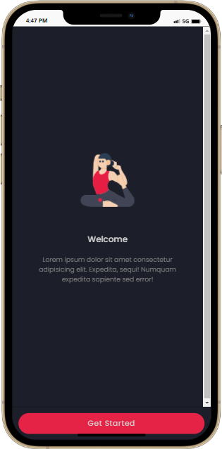
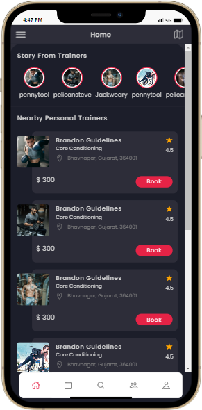
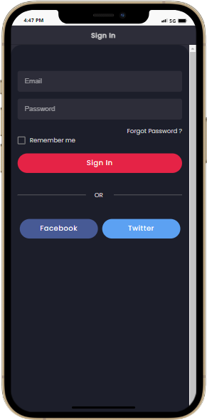
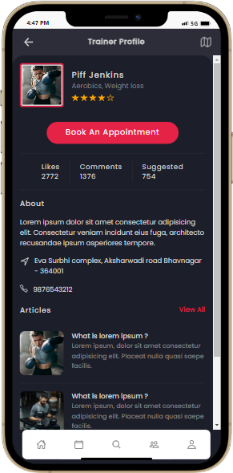

# Mobile App for Gym System
 Fitness is need for todays generation . this app will help the users to maintain the body. this app provide the all jym trainings for the all kind of users. they can also book the trainer to help them to gain or loss their body. also many more feactures 

  


##  Features
- Dashboard view where user can check daily health report 
- can also see the membership of the jym also maintain their plans.
- ultimate workout tracker that helps you to achive the goals 
- can manage daily activity
- can set the diet plan that help to achive the goals 
- group chat is also avaiable  


## Operating System 
this Software support All operating System 
- Android
- IOS
- Desktop
- Web
##  Screenshots

 
  
   
    

## Technologies & Lnaguages 

**Client:** Ionic 6.0 , Capacitor 3.0 & above , Angular , Java Script 

**Server:** REST API's (SlimFramework), PHP 


## Acknowledgements

 - [Learn@Earn Professional Institute Of Computer Science](https://learn2earnn.com)
 - [Learn2Earn Blog](https://ioniccapacitor.com)
 


## Demo
### Admin Demo

[Jym App live demo](https://learn2earn-gym.netlify.app/).


## Authors

- [Learn2Earn Software Solutions](https://github.com/orgs/Learn2Earn-Team)


## Installation

To Install the Project in Directory. Clone With Following link 

```bash
  https://github.com/Learn2Earn-Team/Property-Management-System.git
```
    
## Build For Android

To generate the APK for the Android runn this command 


```bash
  npm run android
```

this command will open Android Studion Software 
and there you will simply build the APK.


## FAQ

#### Can We test the App ?

yes you can install by using upper instruction 

#### What is user name and password ?

Yes you can login by using below credentials
username : admin
password : 2233
role : admin

#### Can We buy Monthly Subscriptions?
yes you can buy the software on Monthly Subscriptions.
for plan you can visit us.
- [Learn2Earn Software Solutions](https://github.com/orgs/Learn2Earn-Team)

#### Can we buy through Onetime Payment?

yes you can also buy through one time payment.
## 🚀 About Us
We are Complete Software house , Running Since 2018 with the team of more then 20 peoples.
we are wroking on different platforms and try to give all services to the clinet 


## Services 
We provide multiple Services
- Android app 
- Ios app 
- Web Development 
- Graphics Designind 
- Animated Videos 
- Digital Marketing 
## 🔗 Links
[](https://learn2earnn.com/L2E_Portfolio.html)
[](https://www.linkedin.com/in/learn2earn-software-solutions-2b62b9262/)
[](https://web.facebook.com/Learn2Earn.Institute)


## Support

For support, email support@learn2earnn.com or Contact us on  [Fiverr](https://www.fiverr.com/learn2earnpk).

